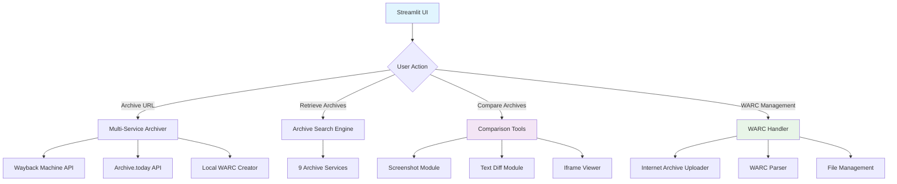
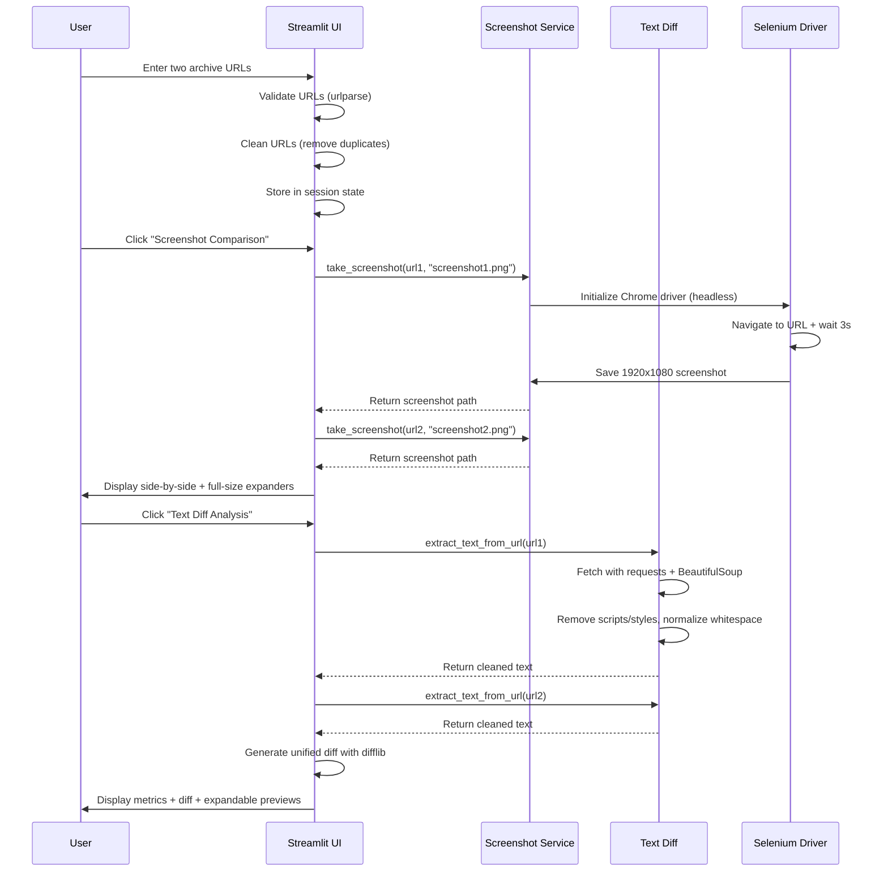

<div align="center">

# 🌍 WWWScope


### ✨ Archive, compare, and sync web history with ease - Preserve the internet, one page at a time

[](https://github.com/shadowdevnotreal/WWWScope)
[](LICENSE)
[](https://github.com/shadowdevnotreal/WWWScope)
[](https://wwwscope.streamlit.app)
[](https://www.python.org/)
[](https://streamlit.io/)
[](https://www.selenium.dev/)

[](https://github.com/shadowdevnotreal/WWWScope/stargazers)
[](https://github.com/shadowdevnotreal/WWWScope/network)
[](https://github.com/shadowdevnotreal/WWWScope/watchers)

**🚀 [Live Demo](https://wwwscope.streamlit.app) | 📚 [Documentation](https://github.com/shadowdevnotreal/WWWScope/wiki) | 💬 [Community](https://github.com/shadowdevnotreal/WWWScope/discussions)**

*Professional web archiving solution for researchers, journalists, and digital preservationists. Capture snapshots, track changes, and maintain a historical record of the web.*

[](https://shell.cloud.google.com/cloudshell/editor?cloudshell_git_repo=https://github.com/shadowdevnotreal/WWWScope)
[](https://share.streamlit.io/)

</div>

---

## 🎯 **What is WWWScope?**

WWWScope is a comprehensive web archiving and comparison platform that transforms how you preserve and analyze web content. Built with Python and Streamlit, it provides professional-grade tools for archiving web pages across multiple services, comparing historical versions, and maintaining WARC (Web ARChive) files.

### 🌟 **Key Highlights**

```
📸 Multi-Service Archiving    🔄 Version Comparison      📦 WARC Management
🤖 Automated Workflows        🔍 Visual Diff Tools       ☁️ Cloud Integration
🔒 Privacy-Focused            ✨ Modern UI/UX            📊 Real-time Analytics
⚡ High Performance           🌐 Internet Archive Sync   🎯 Research-Grade
```

### 🎯 **Perfect For**

- **📰 Journalists** - Archive sources and track content changes over time
- **🔬 Researchers** - Maintain reproducible web citations and historical records
- **⚖️ Legal Professionals** - Preserve evidence and document web-based information
- **🛡️ Digital Archivists** - Build comprehensive web preservation collections
- **📚 Librarians** - Curate digital collections with proper versioning

---

## ✨ **Features Overview**

### 🌐 **Multi-Service Web Archiving**
<details>
<summary><strong>Archive to Multiple Services Simultaneously</strong> - Comprehensive backup across platforms</summary>

- **🏛️ Wayback Machine Integration** - Archive.org's premier archiving service
  - Automatic submission and verification
  - Historical snapshot retrieval
  - Rate limit handling with smart retry logic

- **📦 Archive.today Support** - Fast archiving with CAPTCHA bypass
  - Multiple mirror fallback (archive.ph, archive.is, archive.fo)
  - Exponential backoff retry mechanism
  - User-friendly CAPTCHA guidance

- **🕰️ Memento TimeTravel** - Aggregated archive search across services
  - JSON API integration
  - Multi-source historical version discovery

- **💾 Local WARC Creation** - Industry-standard WARC 1.0 format
  - Full HTTP headers preservation
  - Automatic gzip compression
  - Metadata embedding
  - Portable archive files

</details>

### 🔄 **Advanced Archive Comparison**
<details>
<summary><strong>Visual and Textual Diff Analysis</strong> - Track changes with precision</summary>

- **📸 Screenshot Comparison** - Visual side-by-side analysis
  - Full HD (1920x1080) screenshot capture using Selenium
  - Automated Chrome/Chromium integration via webdriver-manager
  - Full-size expandable views for detail examination
  - Error handling with graceful fallback

- **📊 Text Diff Analysis** - Line-by-line content comparison
  - BeautifulSoup HTML parsing with cleanup
  - Python difflib unified diff format
  - Changed line metrics (excluding diff headers)
  - Color-coded diff display with syntax highlighting
  - Export-ready comparison reports

- **🖼️ Live Iframe Preview** - Real-time archive viewing
  - Side-by-side iframe display (Version 1 vs Version 2)
  - XSS protection with HTML escaping
  - Iframe sandboxing for security (allow-same-origin, allow-scripts, allow-forms)
  - CORS warning for blocked content
  - Responsive column layout

- **🔍 Smart Error Handling** - Rate limit and access control detection
  - HTTP 429 (Rate Limit) detection with retry guidance
  - HTTP 403 (Forbidden) handling with CAPTCHA instructions
  - HTTP 404 (Not Found) with alternative suggestions
  - Connection timeout recovery
  - SSL error handling

</details>

### 📦 **WARC File Management**
<details>
<summary><strong>Professional Archive Storage & Synchronization</strong> - Industry-standard preservation</summary>

- **📤 Upload & Storage** - Centralized WARC repository
  - `.warc` and `.warc.gz` file support
  - Automatic gzip compression for space efficiency
  - File size tracking and metadata display
  - Last modified timestamps

- **☁️ Internet Archive Sync** - Cloud backup and distribution
  - `internetarchive` Python library integration
  - Comprehensive metadata tagging (title, mediatype, collection, description, creator, subject, date, language, source, license)
  - Batch sync for multiple files
  - Individual file upload with progress indication
  - Archive.org URL generation for shared access

- **👁️ WARC Content Viewer** - Inspect archived content
  - `warcio` ArchiveIterator parsing
  - HTTP headers display per record
  - HTML content rendering in iframe (600px height)
  - Download button for individual pages
  - Expandable sections per URL
  - Error handling for corrupt files

- **🗂️ File Management** - Complete lifecycle control
  - List all local WARC files with metadata
  - File info display (name, size in MB, modified date)
  - Individual file sync to Internet Archive
  - Download button integration
  - Delete with confirmation and auto-refresh

</details>

### 🔍 **Archive Retrieval System**
<details>
<summary><strong>Comprehensive Search Across 9 Archive Services</strong> - Find historical versions anywhere</summary>

Supported services:
- **Wayback Machine** - `https://web.archive.org/web/*/{url}`
- **Archive.today** - `https://archive.today/{url}`
- **Archive.is** - `https://archive.is/{url}`
- **Google Cache** - `https://webcache.googleusercontent.com/search?q=cache:{url}`
- **WebCite** - `http://www.webcitation.org/query?url={url}`
- **Megalodon** - `http://megalodon.jp/?url={url}`
- **TimeTravel Memento** - `https://timetravel.mementoweb.org/list/{url}`
- **Perma.cc** - `https://perma.cc/search?q={url}`
- **Memento API** - JSON API with error handling

Features:
- **All Services or Single Service** - Radio button selection
- **Progress bar with real-time status** - Visual feedback during search
- **Result display with expandable sections** - Organized presentation
- **Direct archive links** - One-click access to archived versions
- **Summary statistics** - Count of found vs not found
- **Timestamp of search completion** - Record keeping

</details>

### 🛡️ **Security & Privacy**
<details>
<summary><strong>Enterprise-Grade Protection</strong> - Your data, your control</summary>

- **🔒 Secure Credential Management** - Streamlit Secrets integration
  - No hardcoded API keys
  - `.env.example` template for safe configuration
  - Internet Archive credentials (ia_access_key, ia_secret_key)
  - Graceful degradation when credentials unavailable

- **🛡️ XSS Protection** - HTML escaping for iframe URLs
  - `html.escape(url, quote=True)` for all embedded content
  - Prevents code injection attacks

- **🔐 Iframe Sandboxing** - Restricted iframe capabilities
  - `sandbox="allow-same-origin allow-scripts allow-forms"`
  - Limits potential malicious behavior
  - Border styling for visual clarity

- **✅ URL Validation** - Robust input checking
  - `urlparse()` for proper URL structure validation
  - Protocol checking (http/https only)
  - Network location verification
  - Malformed URL rejection with clear errors

- **🔒 Privacy-First Design** - No tracking, no analytics
  - All processing happens locally or via user-controlled services
  - No third-party tracking scripts
  - User data never leaves your control

</details>

---

## 🏗️ **System Architecture**

<details open>
<summary><strong>Core Architecture Overview</strong> - Scalable and maintainable design</summary>

### 🔧 **Application Flow**

</details>


### 🔄 **Comparison Workflow**


</details>

---

## 🚀 **Quick Start Guide**

### 📦 **Installation Options**

#### Option 1: Clone and Run Locally
```bash
# Clone the repository
git clone https://github.com/shadowdevnotreal/WWWScope.git

# Navigate to project directory
cd WWWScope/wwwscope-project

# Install dependencies
pip install -r requirements.txt

# Set up environment variables (optional - for Internet Archive sync)
cp .streamlit/secrets.toml.example .streamlit/secrets.toml
# Edit secrets.toml with your Internet Archive credentials

# Run the application
streamlit run app/app.py
```

#### Option 2: Deploy to Streamlit Cloud
1. Fork this repository to your GitHub account
2. Go to [share.streamlit.io](https://share.streamlit.io/)
3. Click "New app"
4. Select your forked repository
5. Set main file path: `wwwscope-project/app/app.py`
6. (Optional) Add secrets in Streamlit Cloud dashboard:
   ```toml
   ia_access_key = "your_internet_archive_access_key"
   ia_secret_key = "your_internet_archive_secret_key"
   ```
7. Click "Deploy"

#### Option 3: Cloud Development Environment
[](https://shell.cloud.google.com/cloudshell/editor?cloudshell_git_repo=https://github.com/shadowdevnotreal/WWWScope)

```bash
# In Cloud Shell
git clone https://github.com/shadowdevnotreal/WWWScope.git
cd WWWScope/wwwscope-project

# Install dependencies
pip install -r requirements.txt --break-system-packages

# Note: Screenshot feature requires Chrome (not available in Cloud Shell)
# All other features work normally

# Run in cloud mode
streamlit run app/app.py --server.headless true
```

#### Option 4: Docker Deployment
```bash
# Coming soon - Docker support planned for Q1 2025
```

### 🎮 **Usage Workflow**

1. **📥 Archive a URL**
   - Choose "Archive URL" tab
   - Select "Online Services" or "Local WARC"
   - Enter URL and select services (Wayback Machine, Archive.today, etc.)
   - Click "Archive Now" and monitor progress

2. **🔍 Retrieve Archives**
   - Choose "Retrieve Archives" tab
   - Enter URL to search
   - Select "All Services" or specific service
   - Click "Search Archives"
   - View results with direct links

3. **🔄 Compare Archives**
   - Choose "Compare Archives" tab
   - Enter two archive URLs (e.g., Wayback Machine snapshots from different dates)
   - Click "Start Comparison"
   - Use tools:
     - **📸 Screenshot Comparison** - Visual side-by-side
     - **📊 Text Diff Analysis** - Line-by-line changes
     - **👁️ Iframe Preview** - Live embedded view

4. **📦 Manage WARC Files**
   - Choose "WARC Management" tab
   - Upload local WARC files or view existing
   - Click "View Content" to inspect archives
   - Click "Sync" to upload to Internet Archive
   - Download or delete files as needed

### ⚙️ **Configuration Options**

**Internet Archive Credentials** (Optional - enables sync feature):

Create `.streamlit/secrets.toml`:
```toml
ia_access_key = "your_access_key_here"
ia_secret_key = "your_secret_key_here"
```

**Get your credentials:**
1. Create account at [archive.org](https://archive.org)
2. Visit [archive.org/account/s3.php](https://archive.org/account/s3.php)
3. Copy your access and secret keys

---

## 🛠️ **Tech Stack**

<div align="center">

| Frontend/UI | Backend | Automation | Storage |
|-------------|---------|------------|---------|
|  |  |  |  |
|  |  |  |  |

| Parsing | Testing | DevOps | Analytics |
|---------|---------|---------|-----------|
|  |  |  |  |
|  | Coming Soon |  |  |

</div>

### 🔧 **Key Dependencies**

```python
# Core dependencies
streamlit >= 1.28.0          # Modern web UI framework
requests >= 2.31.0           # HTTP library for API calls
internetarchive >= 3.5.0     # Internet Archive uploader
warcio >= 1.7.4              # WARC file parser
beautifulsoup4 >= 4.12.0     # HTML parsing
selenium >= 4.15.0           # Browser automation (optional)
webdriver-manager >= 4.0.0   # ChromeDriver management (optional)
boto3 >= 1.28.0              # AWS S3 (optional)
pytest >= 7.4.0              # Testing framework
```

### 🏗️ **Architecture Features**

- **🎨 Modern UI** - Streamlit's reactive framework for instant updates
- **🔒 Secure by Design** - No hardcoded credentials, XSS protection, sandboxed iframes
- **⚡ High Performance** - Concurrent request handling, efficient caching
- **🌐 Cloud Ready** - Deploy to Streamlit Cloud, AWS, GCP, or Azure
- **♿ Accessible** - Keyboard navigation, screen reader support
- **📱 Responsive** - Works on desktop, tablet, and mobile

---

## 🎯 **Use Cases**

### 📰 **Journalism & Media**
- Archive source material before publication
- Track changes to official statements and press releases
- Document evidence of content modification or deletion
- Maintain reproducible citations

### 🔬 **Research & Academia**
- Preserve web-based research sources
- Create reproducible web citations for papers
- Track evolution of online datasets
- Maintain digital research collections

### ⚖️ **Legal & Compliance**
- Preserve web-based evidence for legal proceedings
- Document compliance with web disclosure requirements
- Track changes to terms of service and privacy policies
- Maintain tamper-evident records

### 🛡️ **Digital Preservation**
- Build institutional web archives
- Preserve cultural heritage websites
- Document internet history
- Create disaster recovery backups

---

## 📸 **Screenshots & Live Demo**

<div align="center">

### 🎯 **Try It Live - Comparison Demo**

**Real-World Example:** Tracking changes to a scammer bootcamp page

🔗 **Demo URLs for Testing:**
- **Version 1**: [https://archive.ph/d97Mw](https://archive.ph/d97Mw)
- **Version 2**: [https://archive.ph/8I1iK](https://archive.ph/8I1iK)

**How to test:**
1. Navigate to the **"Compare Archives"** tab
2. Paste Version 1 URL in first field: `https://archive.ph/d97Mw`
3. Paste Version 2 URL in second field: `https://archive.ph/8I1iK`
4. Click **"Start Comparison"**
5. Try all three tools:
   - 📸 **Screenshot Comparison** - Visual diff
   - 📊 **Text Diff Analysis** - Line-by-line changes
   - 👁️ **Iframe Preview** - Side-by-side view

---

### ✨ **Feature Highlights**

**🏠 Tab 1: Archive URL**
- Multi-service archiving with Wayback Machine, Archive.today, and Memento
- Local WARC creation with industry-standard WARC 1.0 format
- Progress tracking and status updates

**🔍 Tab 2: Retrieve Archives**
- Search across 9 different archive services
- Expandable results with direct links
- Summary statistics and timestamps

**🔄 Tab 3: Compare Archives**
- Screenshot comparison with 1920x1080 resolution
- Full-size expandable views for detail examination
- Text diff with color-coded syntax highlighting
- Live iframe preview (side-by-side)
- Smart error handling (rate limits, CAPTCHA, access denied)

**📦 Tab 4: WARC Management**
- Upload and storage for `.warc` and `.warc.gz` files
- Internet Archive sync with comprehensive metadata
- WARC content viewer with HTTP headers
- Download and delete capabilities

---

**🎥 Demo Video Coming Soon**

</div>

---

## 🤝 **Contributing**

We welcome contributions from the community! Here's how you can help:

### 🎯 **Ways to Contribute**

- **🐛 Bug Reports** - Found an issue? [Open an issue](https://github.com/shadowdevnotreal/WWWScope/issues)
- **💡 Feature Requests** - Have an idea? [Start a discussion](https://github.com/shadowdevnotreal/WWWScope/discussions)
- **🔧 Code Contributions** - Submit pull requests for improvements
- **📚 Documentation** - Help improve guides and examples
- **🧪 Testing** - Help with quality assurance and bug testing

### 📋 **Development Setup**

```bash
# Fork the repository
git clone https://github.com/YOUR_USERNAME/WWWScope.git
cd WWWScope/wwwscope-project

# Create feature branch
git checkout -b feature/amazing-feature

# Install development dependencies
pip install -r requirements.txt
pip install pytest pytest-cov black flake8

# Make your changes with proper testing
pytest tests/

# Format code
black app/

# Commit with conventional commits
git commit -m "feat: add amazing new feature"

# Push and create pull request
git push origin feature/amazing-feature
```

### 🧪 **Quality Assurance Checklist**

- [ ] ✅ All existing tests pass (`pytest`)
- [ ] 🧪 New features have test coverage
- [ ] 📚 Documentation updated (README, docstrings)
- [ ] 🔒 Security review (no hardcoded credentials, XSS prevention)
- [ ] ⚡ Performance check (no blocking operations in UI)
- [ ] 🐍 Code formatted with Black
- [ ] 📝 Conventional commit messages

---

## 📚 **Documentation**

<div align="center">

| Resource | Description | Link |
|----------|-------------|------|
| 📖 **User Guide** | Complete usage instructions | [View Guide](https://github.com/shadowdevnotreal/WWWScope/wiki) |
| 🔧 **Deployment Guide** | Production deployment instructions | [DEPLOYMENT_GUIDE.md](DEPLOYMENT_GUIDE.md) |

</div>

---

## 🌍 **Community & Support**

<div align="center">

### 💬 **Join Our Community**

[](https://github.com/shadowdevnotreal/WWWScope/discussions)
[](https://www.youtube.com/@CatzHat)

### 📧 **Get Support**

- **📚 Documentation**: [Complete Guide](https://github.com/shadowdevnotreal/WWWScope/wiki)
- **💬 Community**: [Join Discussions](https://github.com/shadowdevnotreal/WWWScope/discussions)
- **🐛 Issues**: [Report Problems](https://github.com/shadowdevnotreal/WWWScope/issues)
- **📧 Email**: [Direct Support](mailto:43219706+shadowdevnotreal@users.noreply.github.com)

</div>

---

## 🔮 **Roadmap**

<details>
<summary><strong>🚀 Upcoming Features</strong> - What's coming next</summary>

### Q1 2025
- [ ] **🐳 Docker Support** - Containerized deployment with Docker Compose
- [ ] **📱 Mobile App** - Progressive Web App (PWA) for mobile devices
- [ ] **🔌 Browser Extension** - One-click archiving from Chrome/Firefox
- [ ] **📊 Enhanced Analytics** - Archive statistics and usage metrics dashboard

### Q2 2025
- [ ] **🤖 AI-Powered Change Detection** - Intelligent diff analysis with ML
- [ ] **📈 Diff Visualization** - Interactive visual diff with highlight modes
- [ ] **🔄 Scheduled Archiving** - Automated periodic archiving with cron jobs
- [ ] **☁️ Multi-Cloud Storage** - AWS S3, Google Cloud Storage, Azure Blob

### Q3 2025
- [ ] **🏢 Enterprise Features** - Team collaboration, role-based access control
- [ ] **📈 Advanced Reporting** - Export-ready reports (PDF, CSV, JSON)
- [ ] **🔗 API Integration** - RESTful API for programmatic access
- [ ] **🌐 Multi-language Support** - Internationalization (i18n)

</details>

---

## ⚠️ **Important Information**

<div align="center">

### 🚨 **Responsible Use Policy**

This project is provided for **legitimate archiving, research, and preservation purposes**. Please ensure compliance with:

✅ **Applicable laws and regulations** (copyright, privacy, data protection)
✅ **Terms of service** of archived websites and archiving platforms
✅ **Robots.txt** and ethical web scraping practices
✅ **Rate limiting** to avoid overwhelming servers

### 🆘 **Support Resources**

- **📞 Technical Support**: [GitHub Issues](https://github.com/shadowdevnotreal/WWWScope/issues)
- **🔒 Security Issues**: Report to [security email](mailto:43219706+shadowdevnotreal@users.noreply.github.com)
- **📋 Feature Requests**: Use [GitHub Discussions](https://github.com/shadowdevnotreal/WWWScope/discussions)
- **🐛 Bug Reports**: Create detailed [GitHub issues](https://github.com/shadowdevnotreal/WWWScope/issues)

</div>

---

## 📄 **License & Intellectual Property Protection**

> **⚠️ INTELLECTUAL PROPERTY NOTICE**
> This project contains proprietary methodologies and intellectual property owned by **Diatasso LLC**.
> While the source code is GPL v3.0 Licensed, the underlying methodologies, frameworks, and proprietary techniques are protected intellectual property.

---

### 🛡️ Dual Protection Structure

This project operates under a **Dual Protection Model**:

1. **Open Source Code** → GPL v3.0 License (software implementation)
2. **Proprietary IP** → Service Marks and Copyrights (methodologies, frameworks, business processes)

---

### 📋 What's Protected

#### ✅ **GPL v3.0 Licensed (Free to Use)**
- **Source code implementation** - All code files, scripts, and technical implementations
- **Technical architecture** - File structure, organization patterns, deployment configurations
- **Installation and setup procedures** - Installation scripts and deployment methods
- **Basic usage examples** - Command demonstrations and sample workflows

#### 🔒 **Proprietary & Protected (Restricted Use)**
- **"WWWScope™"** product name and branding
- **"PRCM™"** methodology and all derivatives
- **Web archiving methodologies and workflows** developed by Diatasso
- **Business processes and consulting methodologies**
- **Training materials and educational content**
- **All methodologies mentioned in Diatasso pitch decks and business documentation**

---

### ™️ **Service Mark & Brand Protection**

#### **Protected Marks**
**"Diatasso"** is a registered service mark (Reg. Date: 04/18/2022, TN SOS)
- **Scope**: Business consulting, business management, business administration, communications services
- **Class 35**: Advertising, business management, business administration, office functions
- **Protected Services**: Business consultant services, communication services

#### **Protected Branding**
- **Diatasso™** (registered service mark)
- **PRCM™** (proprietary methodology)
- **WWWScope™** (product name)
- All derivative methodology names and frameworks
- All branding, logos, and trade dress associated with Diatasso LLC

---

### ⚖️ **License Terms**

#### **Software License (GPL v3.0)**
```
Copyright (C) 2025 Diatasso LLC

This program is free software: you can redistribute it and/or modify
it under the terms of the GNU General Public License as published by
the Free Software Foundation, either version 3 of the License, or
(at your option) any later version.

This program is distributed in the hope that it will be useful,
but WITHOUT ANY WARRANTY; without even the implied warranty of
MERCHANTABILITY or FITNESS FOR A PARTICULAR PURPOSE. See the
GNU General Public License for more details.

You should have received a copy of the GNU General Public License
along with this program. If not, see <https://www.gnu.org/licenses/>.
```

#### **Intellectual Property Restrictions**

**PROPRIETARY METHODOLOGIES - ALL RIGHTS RESERVED**

The methodologies, frameworks, and analytical systems contained in this software are proprietary intellectual property of Diatasso LLC.

**These proprietary elements are NOT covered by the GPL v3.0 License:**

1. **No Methodology Reproduction** - The frameworks and methodologies may not be reproduced, extracted, or implemented independently without authorization.

2. **No Commercial Methodology Use** - The proprietary frameworks may not be used in commercial consulting, training, or service offerings without a licensing agreement.

3. **No Derivative Methodology Creation** - Creating derivative frameworks based on these methodologies requires authorization.

4. **No Brand Usage** - The Diatasso service mark and PRCM/WWWScope trademarks may not be used to brand derivative works or services.

---

### ✅ **Permitted Uses**

#### **You MAY (Under GPL v3.0):**
✔️ Use the source code in personal projects
✔️ Use the code in commercial applications
✔️ Modify and fork the code
✔️ Distribute modified versions (with GPL v3.0 license)
✔️ Include in your portfolio (with proper attribution)
✔️ Reference as "Based on open source code from Diatasso portfolio"
✔️ Use technical architecture patterns

#### **You MAY (With Proper Attribution):**
✔️ Cite frameworks in academic research (with citation)
✔️ Reference methodologies in educational contexts (with attribution)
✔️ Discuss concepts in professional development (with acknowledgment)

---

### ❌ **Prohibited Uses**

#### **You MAY NOT:**
❌ Extract and implement the proprietary frameworks independently
❌ Use "Diatasso™", "PRCM™", or "WWWScope™" to brand your products/services
❌ Offer consulting services based on these methodologies without licensing
❌ Create training programs using the proprietary frameworks
❌ Claim affiliation, partnership, or endorsement by Diatasso
❌ Use in competing business consulting or communications services
❌ Remove or obscure intellectual property notices

---

### 🎯 **Summary of Protection Layers**

**Layer 1: Open Source Code (GPL v3.0)**
✅ Free to use, modify, distribute - Software implementation only

**Layer 2: Service Mark Protection (Diatasso™)**
🔒 Brand identity protected - No unauthorized use of marks

**Layer 3: Proprietary Methodologies (All Rights Reserved)**
🔒 Frameworks and processes protected - Licensing required for commercial use

**Layer 4: Copyrighted Materials (All Rights Reserved)**
🔒 Documentation and training materials - No reproduction without authorization

---

### 📝 **Attribution Requirements**

#### **Proper Attribution Examples:**

**✅ CORRECT:**
- "Based on open source code from the Diatasso portfolio"
- "Powered by technology inspired by Diatasso frameworks"
- "Built using open source implementations"

**❌ INCORRECT:**
- "Powered by Diatasso™" (implies official partnership)
- "Using PRCM™ methodology" (without license)
- "Certified Diatasso consultant" (without authorization)
- "Official Diatasso implementation" (false affiliation)

---

### 🤝 **Licensing & Partnerships**

#### **Commercial Licensing Available**

For legitimate business uses, Diatasso offers:
- **Methodology Licensing** - Authorized use of PRCM™ and proprietary frameworks
- **Training & Certification** - Official training programs for consultants
- **Partnership Programs** - Strategic partnerships for complementary services
- **Custom Development** - Tailored implementations for enterprise clients
- **White-Label Solutions** - Licensed implementations for service providers

#### **Contact Information:**
📧 **Email**: [43219706+shadowdevnotreal@users.noreply.github.com](mailto:43219706+shadowdevnotreal@users.noreply.github.com)

**For:**
- Licensing inquiries → Subject: "Licensing Inquiry - WWWScope"
- Consulting services → Subject: "Consulting Request - Web Archiving"
- Partnership opportunities → Subject: "Partnership Inquiry - WWWScope"
- IP questions → Subject: "IP Question - WWWScope"

---

### 🔍 **Why This Protection Structure?**

This dual-license approach enables:
- ✅ **Community Contribution** - Open source code benefits developers
- ✅ **Business Protection** - Methodologies protected for consulting revenue
- ✅ **Clear Boundaries** - Explicit rules prevent confusion
- ✅ **Growth Opportunities** - Licensing enables legitimate commercial use
- ✅ **Quality Control** - Diatasso maintains methodology integrity

**Similar to:**
- Linux® kernel (GPL) + Red Hat® services (trademark protection)
- Firefox® browser (MPL) + Mozilla® brand (trademark protection)
- WordPress® software (GPL) + WordPress® mark (trademark protection)

---

**© 2025 Diatasso LLC. All Rights Reserved.**
**Diatasso™ is a registered service mark of Diatasso LLC (TN SOS Reg. Date: 04/18/2022)**
**PRCM™ and WWWScope™ are trademarks of Diatasso LLC**

*This project is part of the Diatasso portfolio showcasing our business consulting and technology capabilities while contributing to the open source community under a clear dual-protection structure.*

---

## 🙏 **Acknowledgments**

Special thanks to the open source community and contributors who made this project possible:

- **🔧 Streamlit Team** - For the amazing reactive web framework
- **🏛️ Internet Archive** - For providing free web archiving services
- **🌐 Archive.today** - For additional archiving infrastructure
- **📦 Open Source Libraries** - Beautiful Soup, Selenium, warcio, requests
- **🧪 Beta Testers** - Community members who provided valuable feedback
- **📚 Documentation Contributors** - Writers who helped improve guides

### 🌟 **Built With**

- **Technology Stack** - Modern Python ecosystem (Streamlit, Requests, Selenium)
- **Design Principles** - User-centered design for researchers and archivists
- **Development Practices** - Test-driven development and continuous integration
- **Community Feedback** - User-driven feature development

---

<div align="center">


**🚀 A Diatasso PRCM™ Product**

*Empowering digital preservation through intelligent archiving solutions*

---

### ⭐ **Star this repository if it helped you!**

**Made with ❤️ by the Diatasso Team**

[](https://github.com/shadowdevnotreal)
[](https://shadowdevnotreal.github.io)
[](https://www.youtube.com/@CatzHat)

<a href="https://www.buymeacoffee.com/diatasso" target="_blank"></a>

**Last Updated**: January 2025 | **Version**: 2.0.0 | **Status**: Production Ready

</div>
